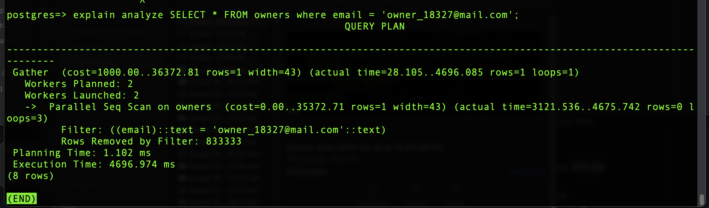
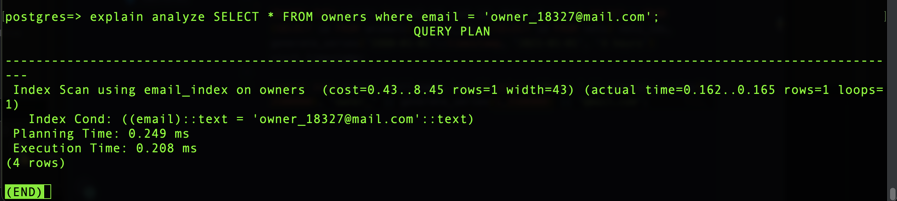

# Vet Database
> In this project, we decrease the execution time for queries by using indexing.

## Built with
- PostgresSQL
- Lots of love :heart:

## Screenshot
### BEFORE INDEX

### AFTER INDEX

## Getting Started
**To get a local copy up and running follow these simple example steps.**
- Clone this repository.
- Make sure you have postgres installed on your local machine

## Author:

👤 **Nikolas Escobal**

[<code></code>](https://github.com/nikoescobal)
[<code></code>](https://twitter.com/nikoescobal)
[<code></code>](https://www.linkedin.com/in/nikolas-escobal/)
 
 

## 🤝 Contributing

Contributions, issues and feature requests are welcome!

Feel free to check the [issues page](../../issues/).
## Show your support

Give a ⭐️ if you like this project!

## Acknowledgments

- Microverse

## 📝 MIT License

This project makes use of the MIT license.

